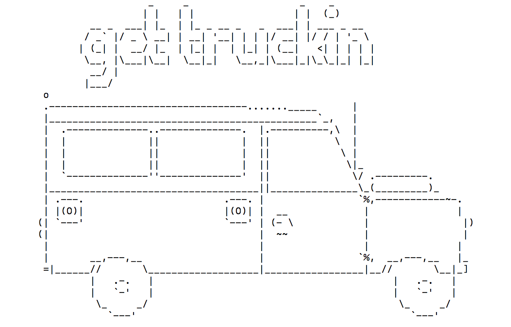

#### Get Truckin' is your #1 resource for finding a food truck where you can chow down fast. It provides a list of all the food trucks that are open right now along with their address. Its database tracks 3,153 food trucks in San Francisco, CA. Some of the food trucks are run by the same restaurant so you may see a truck with the same name, but a different location.

### FAQ's

##### Can you tell me more about the API that powers to app?
All data comes from the ["Mobile Food Schedule"](https://data.sfgov.org/Economy-and-Community/Mobile-Food-Schedule/jjew-r69b) dataset provided by DataSF. Below is a sample entry for one truck. This app leverages the applicant, location, start24, and end24 fields.

##### What are the features of the program?
- Easy to use interface
- Flexible design for similar datasets
- Data encapsulation to prevent accidental corruption

##### How do I run the program?
Note: If the terminal-table gem is already installed, skip step 3.

If using zip file...
1. Open zip file and save in a local folder
2. Open terminal and navigate to the folder where the files were saved

If accessing via Github...
1. Navigate to Github repo
[Get Truckin' repo](https://github.com/brandyaustinseattle/GetTruckin)
2. Clone repository to a local folder

After completing one of the options above...
3. Type `gem install terminal-table` in the terminal and press enter
4. Type `ruby get-truckin.rb` in the terminal and press enter

##### What methods are used to power the program?

###### GetTruckin' class

The primary responsibility of the Get Truckin class is to manage the UI interface. It is composed of public and private methods. The lists below provide more information.

Public methods
- initialize: Initialize GetTruckin with rows (public) and time (private)
- run: Run the program - fetch food truck data, sort trucks by name, and display results using basic CLI pagination

Private methods
- get_trucks: Get list of trucks that are open at the current day and time
- sort_trucks: Sort trucks alphabetically
- display_trucks: Display 10 trucks at a time; Ask user if they want to see more trucks until the user declines or there are no more trucks

Private methods for UI
- print_table(rows): Print formatted table of trucks
- print_more?: Ask user if they want to see more trucks; Repeat question if user responds w/ invalid input
- print_intro
- print_no_trucks
- print_invalid_input
- print_closing
- print_name
- print_truck

###### Truck class

The primary responsibility of the Truck class is to create instances that contain all of the information for a given truck. The list below provides more information.

Methods
- initialize: Initialize truck with info returned from API
- open_today?(time): Determine if the truck is open on the current day of the week
- <=>(truck): Compare trucks by applicant name
- open_now?(now): Determine if the truck is open at the given time
- applicant: Return applicant (name) for the truck
- location: Return location for the truck
- get_time_object(now, time): Get time object for the current day with a given hour and min; Used to calculate the start and end time for trucks that are open on the current day

###### TruckAPI class

The primary responsibility of the TruckAPI class is to manage calls to the API. This class will be particularly useful if the program is expanded to permit calls to additional API's. The list below provides more information.

Methods
- initialize: Initialize truck-api with corresponding url
- get_data: Get data by making call to API with url from initialize

##### How do I edit the program to work with a different API?
If the data structure of the JSON returned by the API matches that of the existing API, the app can be readily adapted to use the data. In this situation, the only concern is the timezone of the start and end times for the food trucks.

The program assumes that the start and end times are in PST and it works regardless of what timezone the user's computer in. If the data provided by the new API uses a different timezone, it's necessary to update `@time` in the initialize function so that it converts the local time to appropriate format.

If more information is needed on performing this type of conversion, see the [Class:Time (Ruby 2.5.3)](https://ruby-doc.org/stdlib-2.5.3/libdoc/time/rdoc/Time.html) documents.

##### What does a sample run of the program look like?

WELCOME TO GET TRUCKIN' - YOUR #1 RESOURCE FOR FINDING A FOOD TRUCK WHERE YOU CAN CHOW DOWN FAST. BELOW IS A LIST OF ALL THE FOOD TRUCKS THAT OPEN RIGHT NOW ALONG WITH THEIR ADDRESS. TO MAKE IT EASY, WE DISPLAY 10 TRUCKS AT A TIME SO PAGE ON THROUGH TO FIND ON THAT HAS YOU READY TO CHOW DOWN.

DO YOU WANT TO SEE MORE TRUCKS? (Y/N): Y

DO YOU WANT TO SEE MORE TRUCKS? (Y/N): ?
WHOOPS - THAT DOESN'T LOOK LIKE Y OR N.

DO YOU WANT TO SEE MORE TRUCKS? (Y/N): Y

DO YOU WANT TO SEE MORE TRUCKS? (Y/N): N

THANKS FOR CHECKING OUT GET TRUCKIN'! COME BACK NEXT TIME YOU NEED TO FIND A FOOD TRUCK WHERE YOU CAN CHOW DOWN FAST. HOPE YOU ENJOY YOUR MEAL.
